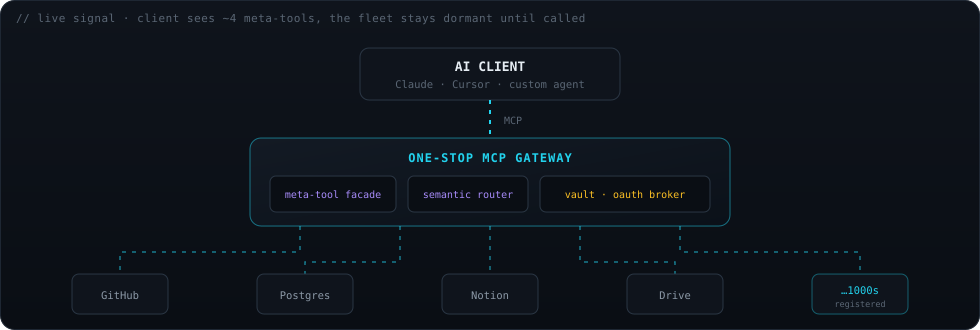

# One-Stop MCP

<sub>This README is the project's original design brief (PDR v0.1). The previous developer README — build status, quickstart, test commands — is archived at [`archive/README.md`](archive/README.md).</sub>

**Product Design & Requirements · v0.1 · Draft for RFC**

## One connection. Every MCP server. Zero context bloat.

An open-source aggregation gateway for the Model Context Protocol. It puts **hundreds or thousands** of MCP servers behind a single endpoint — without ever flooding your agent's context window with tool definitions.

`startup surface < 2k tokens` · `flat cost at 5 or 5,000 servers` · `ships with 50 servers` · `add a server = 1-file PR` · `secrets stay yours`

<p align="center">
  
</p>

**Contents** — [01 The N-servers problem](#01--the-n-servers-problem) · [02 Goals & non-goals](#02--goals--non-goals) · [03 Build philosophy](#03--build-philosophy) · [04 Design architecture](#04--design-architecture) · [05 Security](#05--your-secrets-stay-yours) · [06 Manifest](#06--the-server-manifest) · [07 Seed catalog](#07--seed-catalog--50-on-day-one) · [08 Stack](#08--recommended-stack) · [09 Roadmap](#09--phased-roadmap) · [10 Open questions](#10--open-questions--for-the-rfc) · [11 Contributing](#11--contributing)

---

## 01 · The N-servers problem

The MCP ecosystem has a scaling ceiling built into it. Every server you connect dumps its full tool catalog — names, descriptions, and JSON schemas — straight into the model's context at startup. A single rich server can eat **15–20k tokens**. Past roughly 10–15 active servers, clients slow, degrade, or crash outright. The ecosystem's growth is throttled by the context window itself.

One-Stop MCP is an intelligent membrane between one AI client and an unbounded fleet of downstream servers. It's a spec-compliant MCP **server** to the client, and a spec-compliant MCP **client** to every server behind it. The client sees a lightweight, constant-size interface no matter how many servers are registered.

> [!NOTE]
> **The one-line pitch**
>
> Connect once to One-Stop MCP. Every OAuth, secret, and downstream server is initiated, redirected, and managed inside the gateway — so your agent stays lean and your credentials live in exactly one place.

---

## 02 · Goals & non-goals

| **&lt;2k** | **≥90%** | **1** | **50** |
|:--|:--|:--|:--|
| startup tokens for the gateway surface — at any scale | top-3 routing accuracy on the task benchmark | connection point the user ever configures | servers pre-loaded and ready on first run |

### In scope · v1

- **Flat context** — startup tokens never grow with server count
- **Hybrid discovery** — meta-tool facade + semantic routing
- **One vault** — all secrets & OAuth brokered inside the gateway
- **Batteries included** — 50 common servers seeded
- **One-file contribution** — add a server via a single manifest

### Non-goals · v1

- Building **new** MCP servers — we aggregate existing ones
- Forking or extending the MCP spec — fully compliant
- A hosted SaaS — though the design won't preclude one
- A fine-tuned routing model — off-the-shelf embeddings first

---

## 03 · Build philosophy

Five principles, ordered. When a trade-off is unclear, the earlier principle wins.

1. **Context is the scarcest resource** *(first)* — Every choice is measured first by its effect on the client's window. If a feature adds startup tokens that scale with server count, it's wrong by default.
2. **Spec-compliant on both faces** — A server to the client, a client to every downstream server. Speak the protocol perfectly in both directions. No extensions the ecosystem can't adopt.
3. **One connection, one vault** — Connect once. Every OAuth flow and API key is initiated and stored inside the gateway — a single, auditable trust boundary, not a dozen scattered configs.
4. **Contribution is a one-file PR** — The catalog is the moat, and it only grows if contributing is trivial. Adding a server means writing one declarative manifest — no gateway code, no rebuild.
5. **Local-first, server-ready** — The same binary runs as a desktop proxy and a self-hosted team gateway. We don't build two products. Deployment mode is config, not a fork.

> [!IMPORTANT]
> **Design tenet**
>
> If adding the 1,000th server changes the client's experience at all — in latency, tokens, or reliability — the architecture has failed. Constant-cost scaling is the whole point.

---

## 04 · Design architecture

### 4.1 · The meta-tool facade — context control

Instead of exposing every downstream tool, the gateway exposes a tiny, fixed set of **meta-tools**. This is the single most important mechanism for keeping context flat: the client's startup context holds ~4 tool definitions, a constant. Downstream schemas enter context **only** when a task needs them, then leave.

| meta-tool | purpose |
|---|---|
| `find_tools(query)` | Semantic search over the full catalog. Returns a ranked shortlist of relevant tools + their schemas, injected just-in-time for this turn only. |
| `list_servers(filter?)` | Browse or enumerate registered servers by category, tag, or auth status. Lightweight — no schemas. |
| `invoke(server, tool, args)` | Execute a specific tool on a specific downstream server. The router resolves ownership and forwards the call. |
| `connect_server(server)` | Kick off auth (OAuth redirect / key entry) for a server the user wants to activate. |

> [!NOTE]
> **Why this works**
>
> ~4 tool definitions at startup — a constant. Five servers or five thousand: identical footprint. The catalog can grow without limit because the client never sees it all at once.

### 4.2 · Hybrid discovery — routing + JIT injection

Discovery runs in two cooperating layers, marrying the recall of vector search with the precision of explicit tool selection.

- **Layer A · Semantic pre-filter** — Every tool is embedded — name, description, example utterances — into a local vector index at registration. A task query is scored against the index and the top-K candidates are retrieved **before** any schema touches context.
- **Layer B · Meta-tool JIT injection** — Only the candidates' full schemas are returned to the model, which makes the final tool choice from a clean shortlist and calls `invoke(...)`. Recall from vectors, precision from the model.

**Fallback ladder:** exact / keyword match → vector similarity → category browse via `list_servers`. On low confidence, the gateway widens the shortlist rather than guessing.

### 4.3 · Secret vault & OAuth broker — one place for everything

This is the **one connection, one vault** principle in practice. The user authenticates to the gateway once; every downstream connection is brokered internally, and secrets never reach the client config or the model.

1. The client calls `connect_server("notion")`.
2. The gateway looks up Notion's auth model in its manifest (OAuth2).
3. The gateway initiates the OAuth flow and returns a redirect URL to the user.
4. The user approves in-browser; the callback lands on **the gateway**, not the client.
5. Tokens are encrypted and stored in the vault, scoped to that user + server.
6. All future Notion calls are transparently authenticated by the gateway.

> [!WARNING]
> **Security boundary**
>
> Secrets never live in client config files and are never returned to the model. The vault is the single trust boundary: encrypt-at-rest, per-user / per-org scoping, admin MFA, and a full audit log of every credential use. Downstream keys are injected only into outbound calls.

### 4.4 · Lazy sessions & schema compression

**Registered ≠ running.** A downstream server consumes zero resources until a tool from it is invoked. On first `invoke`, the gateway spawns or connects, pools the live session, and reaps it on a TTL — so CPU and RAM stay flat even with a huge catalog. As a third context defense, an optional compression pass strips redundant JSON-schema boilerplate from the shortlist before it enters context, compounding the savings.

---

## 05 · Your secrets stay yours

Centralizing every credential in one place is only acceptable if that place is a fortress. So we treat security not as a checkbox but as the product's headline strength — and we hand you the tools to watch, rotate, and cut off every connection yourself.

### The core promise — One vault. *Zero* leakage. Complete control.

Every OAuth token and API key lives encrypted in a single vault, scoped to you. It is **never** written to a client config, **never** returned to the model, and **never** exposed to a downstream server beyond the one outbound call it authenticates. One place to secure means one place to lock down — and we hold that boundary to a strict standard.

| standard | how |
|---|---|
| 🔒 **Encrypted at rest** | libsodium-sealed, per-user / per-org key scoping |
| 🛡️ **Least-privilege injection** | keys enter outbound calls only — never context, never logs |
| 🕒 **Admin MFA + audit trail** | every credential use is signed and timestamped |
| 🔌 **Pluggable backend** | swap to HashiCorp Vault or cloud KMS for teams |

### Usage ledger — see exactly where every secret was used

Every time a credential leaves the vault, it's logged: **which server, which tool, when, and the result.** If a platform is calling more than it should — or reaching where it shouldn't — you'll spot the misbehaving connector immediately.

```text
10:42:07   github       · repos.read                authorized
10:42:09   notion       · pages.search              authorized
10:43:15   unknown-crm  · contacts.export ×204      ⚑ FLAGGED
10:43:22   postgres     · query.read                authorized
```

Anomalous access is surfaced — a server suddenly exporting in bulk gets flagged, not silently trusted.

### Master kill switch — doubtful? Cut everything from one place

One control revokes every active session and freezes the entire vault instantly. **All downstream access stops** — no per-server hunting, no waiting. Re-enable connectors one at a time once you've found the culprit.

> [!CAUTION]
> **⏻ REVOKE ALL**
>
> Kills every session, freezes the vault, and blocks all outbound credential use in one action.

Also scoped: revoke a single server, or every session for one user.

### Secret rotation — rotate every credential from one place, on demand or on a schedule

Rotation is normally a per-service chore: log into each dashboard, re-issue a key, paste it into whatever config uses it. Because the vault already brokers every connection, One-Stop MCP turns that into a single action — **rotate one server, a group, or everything** — and every downstream call keeps working because the gateway swaps the credential inline. Set a policy (e.g. every 90 days) and it happens on its own.

| credential | how it rotates |
|---|---|
| 🟢 **OAuth tokens** | The vault holds the refresh token, so it force-refreshes access tokens on demand or on schedule — **fully automated, zero user steps.** |
| 🟡 **API keys** | Where the provider exposes a key-management API, the gateway issues a new key and retires the old one. Where it doesn't, it **walks you through re-issuing** and swaps it in. |
| 🟢 **After a scare** | Hit the kill switch, find the bad actor in the ledger, then **rotate everything it might have seen** — one flow from suspicion to clean slate. |

Honest scope: rotation is automated where a provider supports it, and guided everywhere else — no service is left as a manual blind spot.

> [!WARNING]
> **Why this is a strength, not a risk**
>
> Scattering secrets across a dozen client configs means a dozen blind spots, no way to pull the plug, and rotation nobody ever gets around to. One vault flips all three: total visibility into where your credentials go, a single lever to stop them cold, and one-action rotation to refresh them. Centralization is what makes real oversight possible.

---

## 06 · The server manifest

Adding a server is one declarative file and one PR. The gateway needs zero code changes. This is the contract that makes the FOSS flywheel spin.

`servers/notion.yaml`

```yaml
# one file. one PR. the gateway derives the rest.
id: notion
name: Notion
category: [productivity, docs, knowledge-base]
description: >
  Read, search, and write Notion pages, databases, comments.

transport:
  type: streamable-http        # or: stdio
  url: https://mcp.notion.com/mcp

auth:
  type: oauth2                 # none | api_key | oauth2
  scopes: [read_content, update_content]

routing:                        # powers the semantic index
  examples:
    - "find my meeting notes in notion"
    - "create a page in my workspace"
    - "search the docs database"

health:
  check: initialize
```

**Derived automatically:** the tool list (via MCP `initialize` + `tools/list`), embeddings for the router, the OAuth broker config, and the catalog entry. Contributors never touch gateway internals.

---

## 07 · Seed catalog · 50 on day one

v1 is useful on first run. Contributors extend from there. The exact 50 is locked during the RFC — selection weighs popularity, maintenance activity, breadth, and clean spec-compliance.

| category | servers |
|---|---|
| **Dev & code** | GitHub · GitLab · Filesystem · Git · Sentry · Docker |
| **Data & DB** | Postgres · MySQL · SQLite · Supabase · Redis |
| **Productivity** | Notion · Drive · Calendar · Gmail · Slack · Linear · ClickUp · Asana |
| **Search & web** | Brave Search · Fetch · Puppeteer · scraping servers |
| **Cloud & infra** | AWS · Cloudflare · Vercel · Kubernetes |
| **AI & reasoning** | Sequential Thinking · Memory · vector-store servers |
| **Sales & CRM** | Apollo · HubSpot · Salesforce · Lemlist |

---

## 08 · Recommended stack

Reference implementation in TypeScript / Node — first-class official SDK, the ecosystem's lingua franca, lowest barrier for contributors.

| concern | choice · rationale |
|---|---|
| `core` | **TypeScript / Node** — official MCP SDK, biggest contributor pool. |
| `transports` | **stdio + streamable-HTTP** — desktop and remote from one codebase. |
| `vector index` | **Local embeddings + on-disk ANN** (e.g. hnswlib) — fast, local, no external DB. |
| `vault` | **Encrypted store** (libsodium), pluggable to Vault / KMS for teams. |
| `catalog` | **YAML manifests in-repo** — diff-, review-, PR-friendly. |
| `packaging` | **npx + Docker image** — npx for local, Docker for self-hosted. |

> [!NOTE]
> **Open to debate**
>
> Go is a strong alternative for the gateway core — single static binary, concurrency, low memory — with a TS manifest layer. This is an explicit RFC question, not a settled decision.

---

## 09 · Phased roadmap

| phase | milestone | scope | exit criteria |
|---|---|---|---|
| **P0** · Core | Meta-tool facade | Single downstream server proxied end-to-end over stdio. | one server proxied · startup context < 2k tokens |
| **P1** · Discovery | Registry + semantic router | Manifests, vector index, JIT injection — N servers behind one endpoint. | routing benchmark ≥ 90% top-3 |
| **P2** · Auth | Vault, audit log & kill switch | The `connect_server` flow, encrypted storage, per-use logging, one-place rotation, and master revoke. | OAuth server activated entirely inside the gateway |
| **P3** · Seed | 50 pre-loaded servers | Manifests for the seed catalog + a registry sync worker. | useful on first run · new server = one-file PR |
| **P4** · Team | Multi-tenant + observability | Org scoping, per-user secrets, audit logs, metrics. | self-hosted multi-user deployment |
| **P5** · Community | Contribution machinery | Docs, manifest CI validation, public RFC cadence, governance. | external PRs merging · governance in place |

---

## 10 · Open questions · for the RFC

| # | question |
|---|---|
| Q1 | **Core language** — TypeScript vs Go for the gateway core? |
| Q2 | **The 50** — which exact servers ship in the seed catalog? |
| Q3 | **Embeddings** — local small model vs pluggable remote for higher accuracy? |
| Q4 | **Secret isolation** — per-user encryption keys vs per-org vault partitions? |
| Q5 | **Compression** — how aggressive before it hurts tool-selection accuracy? |
| Q6 | **Registry sync** — auto-ingest from public directories, or curated-only? |
| Q7 | **Rotation policy** — default cadence, and how to handle providers with no key-rotation API? |
| Q8 | **Anomaly detection** — rule-based flagging for the usage ledger, or a learned baseline per connector? |
| Q9 | **Governance** — BDFL, core-team consensus, or foundation-style from day one? |

---

## 11 · Contributing

### Built in the open. Yours to extend.

One-Stop MCP invites contributors from day one. The design deliberately makes the highest-volume contribution — adding a server — the easiest possible action.

| way to contribute | what it involves |
|---|---|
| **Add a server** `good first issue` | Submit one manifest under `/servers`. CI validates it and probes the endpoint. |
| **Sharpen routing** `good first issue` | Add example utterances to existing manifests to improve semantic retrieval. |
| **Core work** | Gateway internals, transports, vault backends, compression — tracked as labeled issues. |
| **Shape the RFC** | Weigh in on the seven open questions before the architecture sets. |

---

<sub>**One-Stop MCP** · PDR v0.1 · draft for community RFC · August 2026 · License · Apache-2.0 (proposed)</sub>
